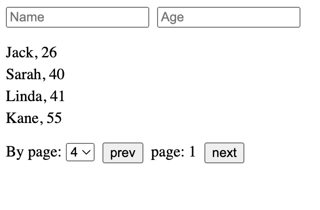

# Техническое задание

В проекте предоставлены две функции: `requestUsers` и `requestUsersWithError`, которые имитируют работу с API. `requestUsers` возвращает Promise с массивом пользователей типа `User[]`, а `requestUsersWithError` возвращает Promise с ошибкой в виде строки.

## Необходимо реализовать следующие требования:

1. Показать список пользователей (имя и возраст через запятую).

2. Показывать текст "Loading..." вместо списка пользователей при загрузке данных.

3. Обработать возможные ошибки при вызове `requestUsers` (можно использовать `requestUsersWithError`) и показать текст ошибки вместо списка пользователей в случае ошибки.

4. Реализовать фильтрацию по имени, передавая поле `name` в аргументе функции `requestUsers`. По умолчанию значение пустой строки.

5. Реализовать фильтрацию по возрасту, передавая поле `age` в аргументе функции `requestUsers`. По умолчанию значение пустой строки.

6. Реализовать возможность смены страницы и количества элементов на странице, передавая `limit` и `offset` в аргументе функции `requestUsers`. Здесь `offset` представляет собой сдвиг и рассчитывается как `(page - 1) * limit`. Значения по умолчанию: `offset - 0`, `limit - 4`.

7. При получении пустого списка пользователей от функции `requestUsers`, показать сообщение "Users not found".

## Пример интерфейса проекта:

Использование стилей, UI-китов и прочего не требуется. Достаточно использования нативных элементов.

